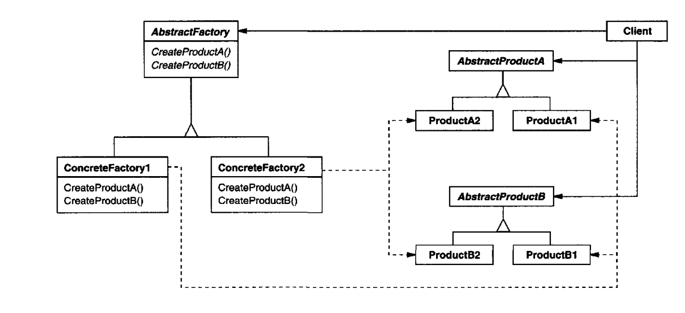

## Intent

Provide an interface for creating families of related or dependent objects without
specifying their concrete classes.

## Motivation

The Abstract Factory pattern lets you produce families of related objects (e.g., buttons, scrollbars, menus for a specific OS theme) without coupling your code to their concrete classes, so you can swap an entire product family by changing a single factory. This keeps client code working against interfaces while the factory encapsulates which concrete variants get created together.

## Applicability

Use the Abstract Factorypattern when
1. a system should be independent of how its products are created, composed,
and represented.
2. a system should be configured with one of multiple families of products.
3. a family of related product objects is designed to be used together, and you
need to enforce this constraint.
4. you want to provide a class library of products, and you want to reveal just
their interfaces, not their implementations.

## Structure

## Consequences

1. Creating new types of "products" is difficult. That's because theAbstractFactory
interface fixesthe set of products that can be created.Supporting new kindsof
products requires extending the factory interface, which involves changing
the AbstractFactoryclass and all of its subclasses. 

2. It promotes consistency among products.

3. It isolates concrete classes.